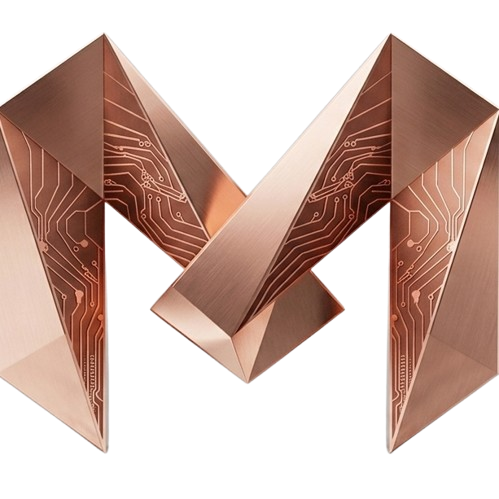

# Marvex

<p align="center">
  
</p>

Marvex is a service-ready modular desktop system. It starts as a Python Core Service with a CLI client, provider adapters, and telemetry, then grows into a process-ready desktop application where major modules can be replaced, disabled, or moved into subprocesses.

Implementation is forbidden until the planning documents are accepted. `PROJECT_STATUS.md` is authoritative: while `accepted_docs: false`, the workspace is planning-only and may contain only documentation, templates, service maps, architecture rules, and governance validation scripts.

AI agents must run the validation scripts before finishing any task, including a one-line hotfix. The required command is:

```powershell
python scripts/run_all_checks.py
```

The user is not expected to review code correctness. Agents must not rely on user code review as a safety mechanism. Every implementation step must be controlled by contracts, task specs, tests, validation scripts, and a final report.

## Current Boundary

Allowed now:

- Documentation
- Architecture maps
- Templates
- README-only placeholder folders
- Governance validation scripts

Forbidden now:

- Product implementation
- Feature code
- App, Core, or provider runtime implementation
- Provider logic outside approved adapter tasks
- UI code
- Tool execution
- Memory systems
- Voice, vision, desktop context, proactive behavior

Docs become accepted only through explicit user approval after blockers are resolved and `python scripts/run_all_checks.py` passes. A roadmap entry, task id, or placeholder README is not permission to implement.
