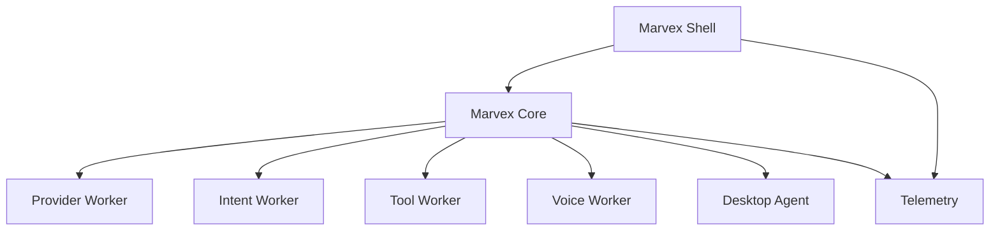

# Future Process Map

```mermaid
flowchart TB
  Shell["Marvex Shell"] --> Core["Marvex Core"]
  Core --> Provider["Provider Worker"]
  Core --> Intent["Intent Worker"]
  Core --> Tools["Tool Worker"]
  Core --> Voice["Voice Worker"]
  Core --> Desktop["Desktop Agent"]
  Core --> Telemetry["Telemetry"]
  Shell --> Telemetry
```

This diagram is a target process shape, not v1 implementation permission.

