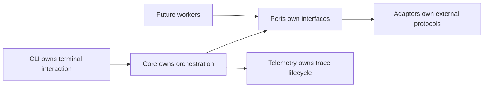

# Module Boundaries

```mermaid
flowchart LR
  Core["Core owns orchestration"] --> Ports["Ports own interfaces"]
  Ports --> Adapters["Adapters own external protocols"]
  Core --> Telemetry["Telemetry owns trace lifecycle"]
  CLI["CLI owns terminal interaction"] --> Core
  Future["Future workers"] --> Ports
```

Core must not absorb provider, UI, memory, tool, voice, or desktop responsibilities.

