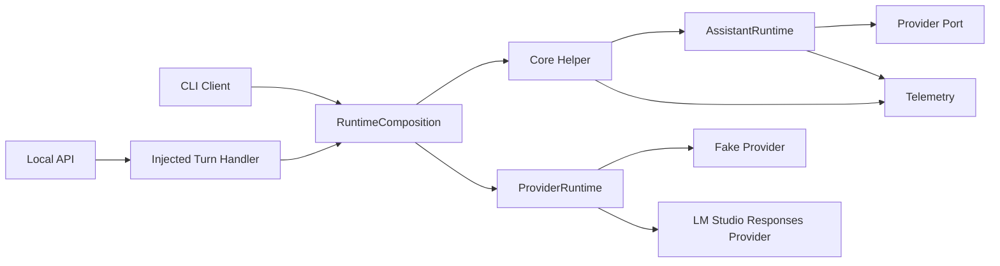

# System Overview

```mermaid
flowchart LR
  CLI["CLI Client"] --> RuntimeComposition["RuntimeComposition"]
  LocalAPI["Local API"] --> InjectedHandler["Injected Turn Handler"]
  InjectedHandler --> RuntimeComposition
  RuntimeComposition --> Core["Core Helper"]
  RuntimeComposition --> ProviderRuntime["ProviderRuntime"]
  Core --> AssistantRuntime["AssistantRuntime"]
  AssistantRuntime --> ProviderPort["Provider Port"]
  ProviderRuntime --> FakeProvider["Fake Provider"]
  ProviderRuntime --> LMStudio["LM Studio Responses Provider"]
  AssistantRuntime --> Telemetry["Telemetry"]
  Core --> Telemetry
```

V1 is intentionally small. The Local API path is fake-provider only and uses an
injected handler; real-provider API execution and future modules are not
implemented yet.
