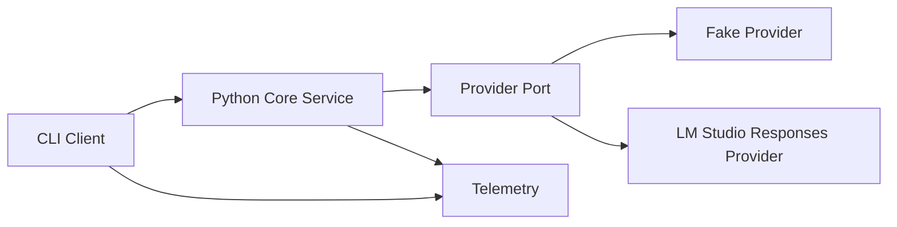

# System Overview

```mermaid
flowchart LR
  CLI["CLI Client"] --> Core["Python Core Service"]
  Core --> ProviderPort["Provider Port"]
  ProviderPort --> FakeProvider["Fake Provider"]
  ProviderPort --> LMStudio["LM Studio Responses Provider"]
  Core --> Telemetry["Telemetry"]
  CLI --> Telemetry
```

V1 is intentionally small. Future modules are not implemented yet.

