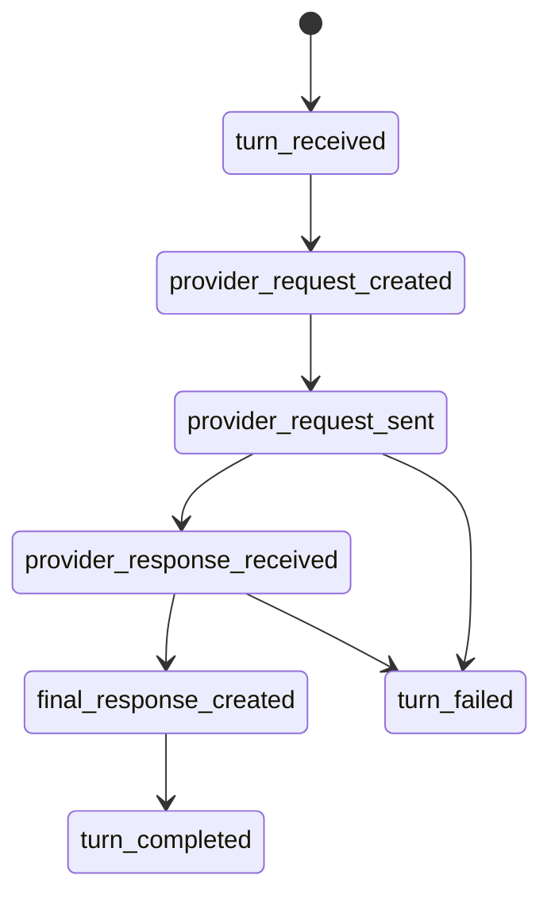

# Trace Lifecycle

```mermaid
stateDiagram-v2
  [*] --> turn_received
  turn_received --> provider_request_created
  provider_request_created --> provider_request_sent
  provider_request_sent --> provider_response_received
  provider_response_received --> final_response_created
  final_response_created --> turn_completed
  provider_request_sent --> turn_failed
  provider_response_received --> turn_failed
```

Every state transition must carry the same `trace_id`.

This diagram is normative for the required V1 lifecycle events listed in `docs/TELEMETRY.md`.
