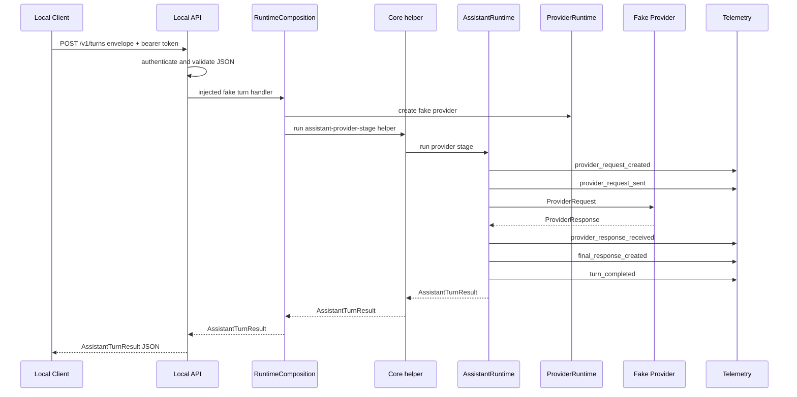

# V1 Process Map

Failure path: Local API auth/request failures return top-level `ErrorEnvelope`.
Provider-stage failures returned by the injected handler remain inside
`AssistantTurnResult.error`.
