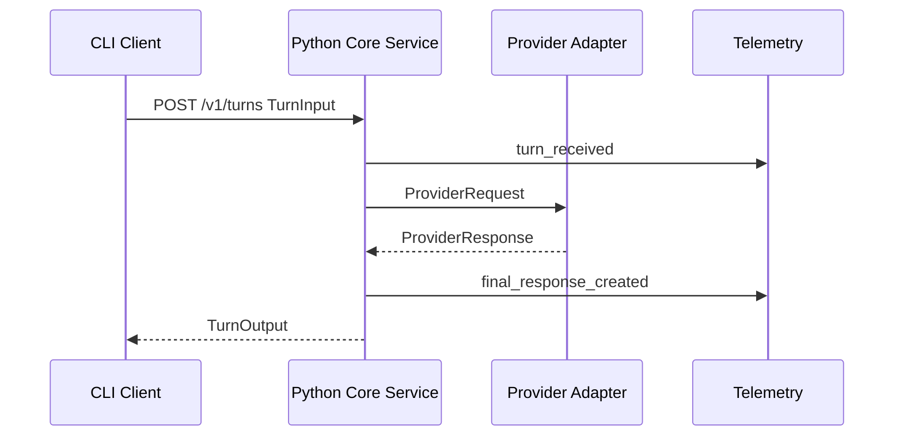

# V1 Process Map

```mermaid
sequenceDiagram
  participant CLI as CLI Client
  participant Core as Python Core Service
  participant Provider as Provider Adapter
  participant Telemetry as Telemetry

  CLI->>Core: POST /v1/turns TurnInput
  Core->>Telemetry: turn_received
  Core->>Provider: ProviderRequest
  Provider-->>Core: ProviderResponse
  Core->>Telemetry: final_response_created
  Core-->>CLI: TurnOutput
```

