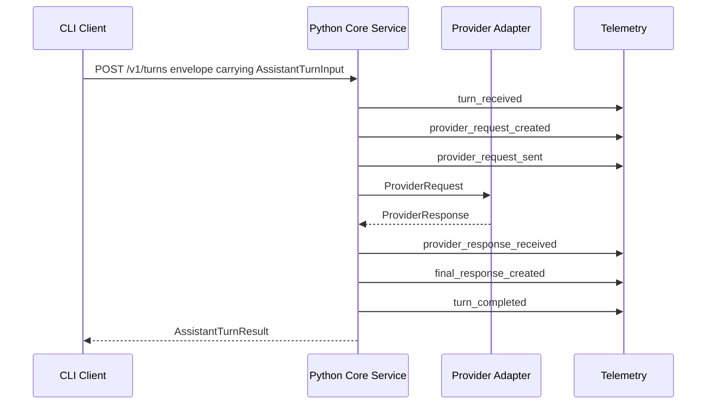

# V1 Process Map

```mermaid
sequenceDiagram
  participant CLI as CLI Client
  participant Core as Python Core Service
  participant Provider as Provider Adapter
  participant Telemetry as Telemetry

  CLI->>Core: POST /v1/turns envelope carrying AssistantTurnInput
  Core->>Telemetry: turn_received
  Core->>Telemetry: provider_request_created
  Core->>Telemetry: provider_request_sent
  Core->>Provider: ProviderRequest
  Provider-->>Core: ProviderResponse
  Core->>Telemetry: provider_response_received
  Core->>Telemetry: final_response_created
  Core->>Telemetry: turn_completed
  Core-->>CLI: AssistantTurnResult
```

Failure path: after `provider_request_sent` or `provider_response_received`, Core emits `turn_failed` and returns an `AssistantTurnResult` with `error`.
